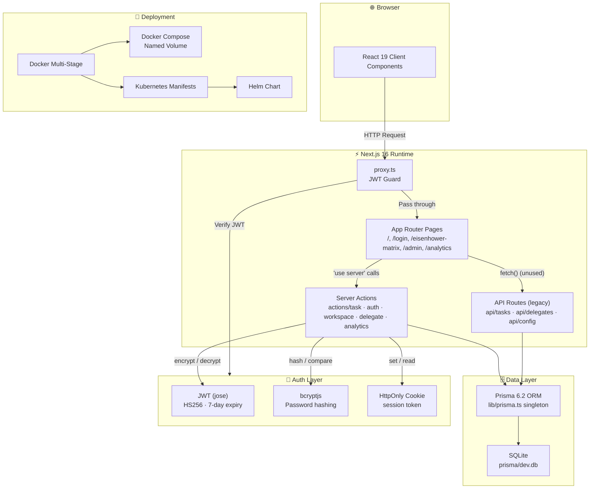
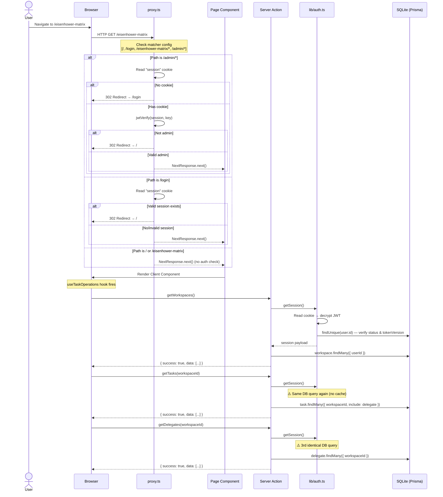
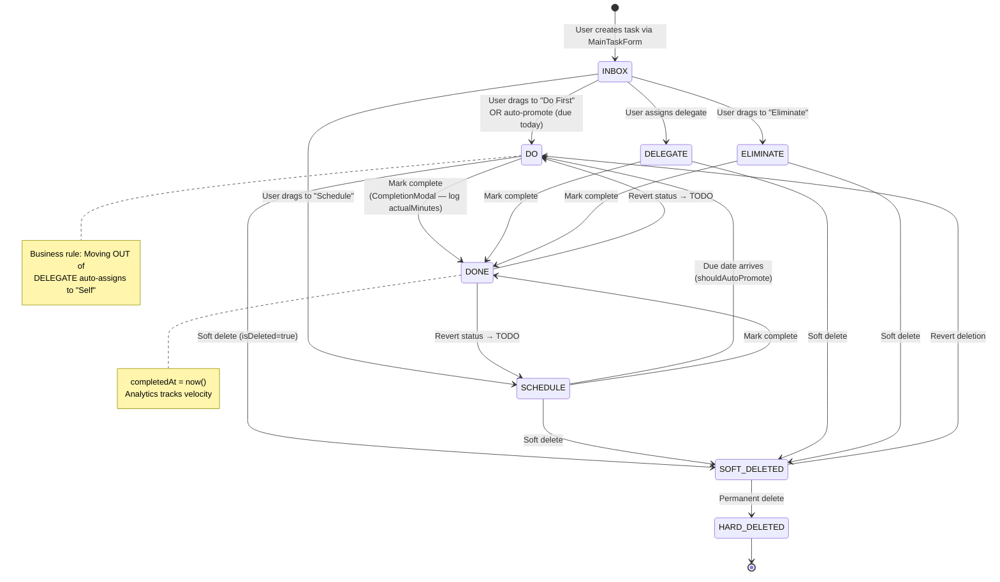
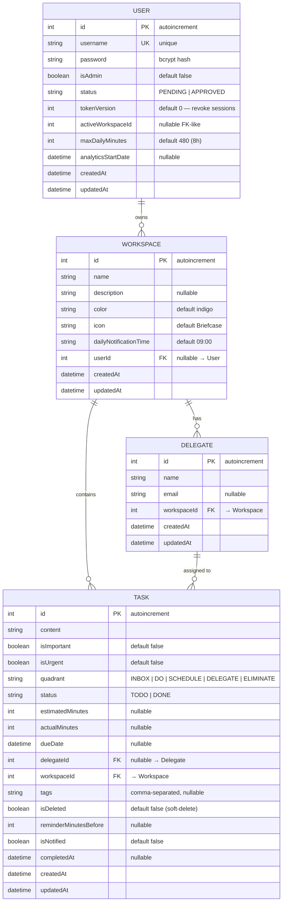
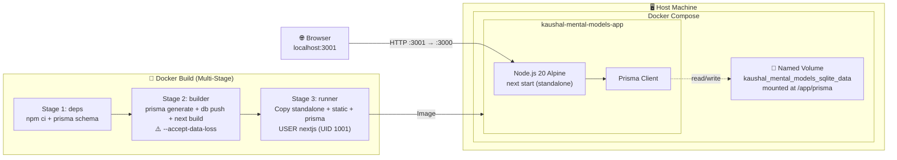

# Kaushal Mental Models — Codebase Analysis

> **Date**: May 23, 2026  
> **Branch**: `feature/persist-db-volume`  
> **Diagram**: [codebase-analysis.excalidraw](./codebase-analysis.excalidraw)

---

## Table of Contents

- [Architecture Overview](#architecture-overview)
- [Tech Stack](#tech-stack)
- [What's Done Well](#whats-done-well)
- [Security Issues](#security-issues)
- [Code Quality Issues](#code-quality-issues)
- [Database & Data Layer](#database--data-layer)
- [Performance](#performance)
- [Deployment](#deployment)
- [Prioritized Recommendations](#prioritized-recommendations)
- [File Map](#file-map)

---

## Architecture Overview

### 1. High-Level System Layers



---

### 2. Frontend Component Hierarchy

```mermaid
graph TD
    RootLayout["RootLayout<br/>layout.tsx<br/>ThemeProvider + createInitialAdmin()"]

    RootLayout --> Home["page.tsx (Homepage)<br/>433 LOC · Client Component"]
    RootLayout --> Login["login/page.tsx<br/>Login + Request Account"]
    RootLayout --> Matrix["eisenhower-matrix/page.tsx<br/>26K · Main Application"]
    RootLayout --> Admin["admin/<br/>User Management Panel"]
    RootLayout --> Analytics["analytics/<br/>Dashboard"]

    Home --> ModelCards["Model Cards<br/>Eisenhower · Pareto · First Principles · Occam"]
    Home --> PassModal["Change Password Modal"]
    Home --> NavBar["Top NavBar<br/>User info · Admin link · Theme toggle"]
    Home --> Footer["Footer<br/>Social links"]

    Matrix --> Hook["useTaskOperations Hook<br/>487 LOC · Central State"]

    Hook --> MatrixHeader["MatrixHeader<br/>21K"]
    Hook --> MatrixGrid["MatrixGrid → 4× Quadrant"]
    Hook --> MainTaskForm["MainTaskForm<br/>Task input"]
    Hook --> CalendarView["CalendarView"]
    Hook --> StatsView["StatsView"]
    Hook --> WSSwitcher["WorkspaceSwitcher"]

    Hook --> Modals["11 Modal Components"]
    Modals --> EditContent["EditContentModal"]
    Modals --> Assignment["AssignmentModal"]
    Modals --> Completion["CompletionModal"]
    Modals --> DatePicker["DatePickerModal"]
    Modals --> DelegateMdl["DelegateModal"]
    Modals --> DeletedList["DeletedListModal"]
    Modals --> DoneList["DoneListModal"]
    Modals --> HelpMdl["HelpModal"]
    Modals --> Onboarding["OnboardingModal"]
    Modals --> ResetConfirm["ResetConfirmModal"]
    Modals --> Settings["SettingsModal"]

    MatrixGrid --> TaskCard["TaskCard<br/>9.5K · Drag & Drop"]
    WSSwitcher --> WSModal["WorkspaceSelectionModal<br/>20K"]
```



---

### 3. Request Lifecycle & Auth Flow



---

### 4. Data Flow: Task Lifecycle



---

### 5. Database ER Diagram



**Indexes:**

| Model | Index | Purpose |
|---|---|---|
| Task | `quadrant` | Filter by matrix quadrant |
| Task | `status` | Filter TODO vs DONE |
| Task | `dueDate` | Auto-promote scheduling |
| Task | `workspaceId` | Workspace isolation |
| Delegate | `workspaceId` | Workspace scoped queries |
| Delegate | `[name, workspaceId]` (unique) | Prevent duplicate names per workspace |
| Workspace | `[name, userId]` (unique) | Prevent duplicate workspace names per user |

---

### 6. Deployment Topology



```
Port Mapping:   Host :3001  →  Container :3000
Environment:    NODE_ENV=production
                DATABASE_URL=file:/app/prisma/dev.db
                ⚠️ JWT_SECRET — NOT SET (uses hardcoded fallback)
Volume:         sqlite_data → /app/prisma (persists DB across restarts)
```

---

### 7. Server Action → Data Layer Map

| Server Action | Auth | Workspace Check | Prisma Models Touched | Revalidates |
|---|---|---|---|---|
| `login()` | Rate limit | — | User | — |
| `requestAccount()` | Rate limit | — | User | — |
| `createUser()` | Admin JWT | — | User, Workspace | — |
| `getUsers()` | Admin JWT | — | User | — |
| `getPendingUsers()` | Admin JWT | — | User | — |
| `approveUser()` | Admin JWT | — | User, Workspace | — |
| `deleteUser()` | Admin JWT | — | User | — |
| `changeUserPassword()` | JWT | — | User | — |
| `getTasks()` | JWT | ✅ | Task, Delegate | — |
| `createTask()` | JWT | ✅ | Task, Delegate | `/eisenhower-matrix` |
| `updateTask()` | JWT | ✅ | Task, Delegate | `/eisenhower-matrix` |
| `deleteTaskAction()` | JWT | ✅ | Task | `/eisenhower-matrix` |
| `resetTasksAction()` | JWT | Scoped | Task, Workspace | `/eisenhower-matrix` |
| `getWorkspaces()` | JWT | Scoped | Workspace | — |
| `createWorkspace()` | JWT | — | Workspace | `/eisenhower-matrix` |
| `updateWorkspace()` | JWT | ✅ | Workspace | `/eisenhower-matrix` |
| `deleteWorkspace()` | JWT | ✅ | Task, Workspace | `/eisenhower-matrix` |
| `getDelegates()` | JWT | ✅ | Delegate | — |
| `createDelegate()` | JWT | ✅ | Delegate | `/eisenhower-matrix` |
| `deleteDelegateAction()` | JWT | ✅ | Delegate | `/eisenhower-matrix` |
| `getAnalyticsData()` | JWT | ✅ | Task, Delegate | — |

---

## Tech Stack

| Dimension       | Technology                                |
|-----------------|-------------------------------------------|
| **Framework**   | Next.js 16.1.3, React 19.2.3             |
| **Styling**     | Tailwind CSS v4                           |
| **Database**    | SQLite via Prisma 6.2.1                   |
| **Auth**        | JWT (jose) + bcryptjs, cookie sessions    |
| **Charts**      | Recharts 3.6                              |
| **Icons**       | Lucide React                              |
| **Deployment**  | Docker, Docker Compose, K8s, Helm         |
| **Language**    | TypeScript 5                              |
| **Testing**     | Playwright (dev dependency, setup present)|

---

## What's Done Well

### 1. Clean Server Action Architecture
All data mutations go through `src/actions/` with the `"use server"` directive — the modern recommended Next.js pattern. Every action validates authentication via `getSession()` and workspace ownership via `verifyWorkspaceAccess()`.

### 2. Optimistic UI Updates
`useTaskOperations.ts` implements optimistic updates for all CRUD operations — the UI updates instantly and reconciles with the server afterward, resulting in a snappy user experience.

### 3. Smart Scheduling Logic
Tasks with a due date of today or tomorrow are automatically promoted to the **DO** quadrant. If the task is delegated, it goes to **DELEGATE** instead. This is a thoughtful UX pattern for a productivity app.

### 4. Security Headers
`next.config.ts` configures:
- `Strict-Transport-Security` (HSTS)
- `Content-Security-Policy` (CSP)
- `X-Frame-Options: DENY`
- `X-Content-Type-Options: nosniff`
- `X-XSS-Protection`
- `Referrer-Policy`

### 5. Multi-Tenant Workspace Isolation
Every data-mutating action verifies workspace ownership. Non-admin users can only access their own workspaces. The pattern is consistent across all actions.

### 6. Comprehensive Deployment Infrastructure
Full coverage with Docker (multi-stage build), Docker Compose (with named SQLite volume), vanilla Kubernetes manifests, and Helm chart — all well-organized under `deployment/`.

### 7. Soft-Delete Pattern
Tasks use an `isDeleted` flag for soft deletion with a "Trash" view for recovery, preventing accidental data loss.

---

## Security Issues

### 🚨 CRITICAL: Hardcoded JWT Secret Fallback

**Files**: `src/lib/auth.ts:5`, `src/proxy.ts:4`

```typescript
const secretKey = process.env.JWT_SECRET || "super-secret-key-for-development";
```

If `JWT_SECRET` is not set in production (and it's **NOT** set in `docker-compose.yml`), the app silently falls back to a publicly known secret. Anyone can forge valid session tokens.

**Fix**: Remove the fallback entirely. Throw an error at startup if `JWT_SECRET` is missing. Add `JWT_SECRET` to `docker-compose.yml`.

---

### 🚨 CRITICAL: Default Admin Credentials (admin/admin)

**File**: `src/actions/auth.ts:118`

An `admin` user with password `admin` is created automatically. While a login page banner appears when the default password is active, there is no forced password change.

**Fix**: Force a password change on first admin login, or generate a random initial password logged to stdout.

---

### ⚠️ HIGH: `createInitialAdmin()` Called on Every Request

**File**: `src/app/layout.tsx:22`

```typescript
await createInitialAdmin(); // runs on EVERY page render
```

This queries the database on every single page load to check if the admin exists — performance overhead and a timing attack surface.

**Fix**: Move to a one-time migration/seed step, or use a runtime cache flag.

---

### ⚠️ MEDIUM: No Input Validation / Sanitization

None of the server actions validate input length, format, or content:
- No minimum password length enforced
- Task content has no max length
- API route raw body values passed straight to Prisma

**Fix**: Add Zod schema validation on all inputs.

---

### ⚠️ MEDIUM: Rate Limiter is In-Memory Only

**File**: `src/actions/auth.ts:11`

The `rateLimitMap` resets on every server restart and doesn't work across multiple instances.

**Note**: Acceptable for single-instance SQLite app, but misleading for scaled deployments.

---

## Code Quality Issues

### 1. Duplicated Code: API Routes vs Server Actions

Two parallel implementations exist for the same CRUD logic:

| Operation    | Server Action           | API Route                |
|-------------|-------------------------|--------------------------|
| Get Tasks   | `actions/task.ts:19`    | `api/tasks/route.ts:15`  |
| Create Task | `actions/task.ts:51`    | `api/tasks/route.ts:55`  |
| Update Task | `actions/task.ts:98`    | `api/tasks/route.ts:121` |
| Delete Task | `actions/task.ts:151`   | `api/tasks/route.ts:195` |

The UI **only** uses Server Actions. API routes appear unused.

**Fix**: Remove API routes or extract shared business logic into a service layer.

---

### 2. Duplicated `verifyWorkspaceAccess()`

Defined **4 separate times** across:
- `actions/task.ts:9`
- `actions/delegate.ts:8`
- `actions/analytics.ts:18`
- `api/tasks/route.ts:7`

**Fix**: Extract to `lib/workspace-access.ts`.

---

### 3. Excessive `any` Types

Heavy use of `any` degrades TypeScript safety:
- `encrypt(payload: any)` — `lib/auth.ts:8`
- `decrypt(): Promise<any>` — `lib/auth.ts:16`
- `useState<any>(null)` — `page.tsx:31`
- `(prisma as any).task` — multiple places in API routes
- `configRes.data as unknown as User` — hooks

**Fix**: Define a `JWTPayload` interface and use it consistently.

---

### 4. Broken Seed Script

`prisma/seed.js` references `prisma.userConfig` (line 35) which doesn't exist in the current `schema.prisma`. It also uses `where: { name: "Self" }` which won't work with the composite unique key `[name, workspaceId]`.

**Fix**: Update seed to match current schema.

---

### 5. Homepage is 433 Lines (Single Component)

`src/app/page.tsx` mixes data fetching, password change logic, model card rendering, and footer in one file.

**Fix**: Extract into:
- `<ModelCard />`
- `<ChangePasswordModal />`
- `<SiteFooter />`
- `<TopNavBar />`

---

## Database & Data Layer

### Schema (4 Models)

```
Task ──→ Delegate (optional FK, onDelete: SetNull)
Task ──→ Workspace (required FK, onDelete: Cascade)
Delegate ──→ Workspace (required FK, onDelete: Cascade)
Workspace ──→ User (optional FK, onDelete: Cascade)
```

### Indexes

| Model     | Indexed Fields                           |
|-----------|------------------------------------------|
| Task      | `quadrant`, `status`, `dueDate`, `workspaceId` |
| Delegate  | `workspaceId`                            |
| Workspace | Composite: `[name, userId]` (unique)     |

### SQLite in Production

- **No concurrent writes**: Multiple simultaneous users may hit `SQLITE_BUSY`.
- **Schema drift risk**: `prisma db push --accept-data-loss` in the Dockerfile build step silently drops data on schema changes. Combined with volume persistence, this can cause the running container to have an outdated schema.

### Root-Level dev.db

A `dev.db` (20KB) exists in the project root in addition to `prisma/dev.db` (61KB). While `.gitignore` lists `*.db`, verify it's not tracked.

---

## Performance

### 1. N+1 Query in Auto-Promote

```typescript
// useTaskOperations.ts:149-165
const updates = data!.map(async (t: Task) => {
  await updateTaskAction(t.id, { quadrant: targetQuadrant });
});
```

Each promoted task fires a separate server action. 10 tasks due today = 10 sequential DB writes.

**Fix**: Bulk-update server action.

---

### 2. `getSession()` Called Multiple Times per Request

In sequences like "get workspaces → get tasks → get delegates", `getSession()` is called 3 times, each hitting the database.

**Fix**: Cache with React's `cache()` function:
```typescript
import { cache } from 'react';
export const getSession = cache(async () => { /* ... */ });
```

---

### 3. Proxy Matcher Too Broad

```typescript
matcher: ["/", "/login", "/eisenhower-matrix/:path*", "/admin/:path*"],
```

Proxy runs JWT verification on `/` and `/eisenhower-matrix` but only actually **redirects** for `/admin` and `/login`. The other two just call `NextResponse.next()`.

**Fix**: Remove unused routes from matcher or add actual logic.

---

## Deployment

### Docker Compose: Missing `JWT_SECRET`

```yaml
environment:
  - NODE_ENV=production
  - PORT=3000
  - DATABASE_URL=file:/app/prisma/dev.db
  # JWT_SECRET is MISSING → uses hardcoded fallback
```

**Fix**: Add `JWT_SECRET=<random-strong-secret>`.

---

### VOLUME Placement Redundancy

The `VOLUME /app/prisma` in the Dockerfile creates an anonymous volume. Docker Compose also defines a named volume for the same path. The Dockerfile `VOLUME` is redundant and can cause confusion.

**Fix**: Remove `VOLUME` from Dockerfile; manage volumes exclusively in `docker-compose.yml`.

---

### Schema Drift Risk

Build runs `prisma db push --accept-data-loss` → creates fresh DB inside image. Docker Compose volume overrides it at runtime. Schema changes **won't** reach the persisted DB.

**Fix**: Run `npx prisma migrate deploy` in the container's startup command (`CMD`), not the build step.

---

## Prioritized Recommendations

| Priority | Issue | Effort | Sprint |
|----------|-------|--------|--------|
| 🔴 P0 | Add `JWT_SECRET` to docker-compose, remove fallback | 5 min | Immediate |
| 🔴 P0 | Fix `prisma db push --accept-data-loss` → `migrate deploy` at runtime | 30 min | Immediate |
| 🟠 P1 | Add Zod input validation to all server actions | 2 hrs | This Sprint |
| 🟠 P1 | Remove or consolidate duplicate API routes | 1 hr | This Sprint |
| 🟠 P1 | Fix broken seed script (`userConfig` removed) | 15 min | This Sprint |
| 🟠 P1 | Extract `verifyWorkspaceAccess` to shared utility | 15 min | This Sprint |
| 🟡 P2 | Cache `getSession()` with React `cache()` | 10 min | Next Sprint |
| 🟡 P2 | Move `createInitialAdmin()` out of layout | 30 min | Next Sprint |
| 🟡 P2 | Decompose 433-line homepage into smaller components | 1 hr | Next Sprint |
| 🟡 P2 | Replace `any` types with proper interfaces | 1 hr | Next Sprint |
| 🟢 P3 | Bulk-update action for auto-promote | 30 min | Backlog |
| 🟢 P3 | Remove redundant `VOLUME` from Dockerfile | 2 min | Backlog |
| 🟢 P3 | Clean proxy matcher to only relevant routes | 5 min | Backlog |

---

## File Map

```
kaushal-mental-models/
├── src/
│   ├── app/
│   │   ├── page.tsx                    # Homepage (433 LOC)
│   │   ├── layout.tsx                  # Root layout + createInitialAdmin()
│   │   ├── globals.css                 # Tailwind v4 base
│   │   ├── login/page.tsx              # Login / Request Account
│   │   ├── admin/                      # User management panel
│   │   ├── analytics/                  # Analytics dashboard
│   │   ├── eisenhower-matrix/page.tsx  # Main app (26K)
│   │   └── api/
│   │       ├── tasks/route.ts          # ⚠️ Duplicate of actions/task.ts
│   │       ├── delegates/route.ts      # ⚠️ Duplicate of actions/delegate.ts
│   │       └── config/route.ts         # Config API
│   ├── actions/
│   │   ├── auth.ts                     # Auth server actions (372 LOC)
│   │   ├── task.ts                     # Task CRUD (225 LOC)
│   │   ├── workspace.ts               # Workspace CRUD (163 LOC)
│   │   ├── delegate.ts                 # Delegate CRUD (95 LOC)
│   │   └── analytics.ts               # Analytics data (188 LOC)
│   ├── components/eisenhower-matrix/
│   │   ├── CalendarView.tsx
│   │   ├── MainTaskForm.tsx
│   │   ├── MatrixGrid.tsx
│   │   ├── MatrixHeader.tsx            # 21K — largest component
│   │   ├── Quadrant.tsx
│   │   ├── StatsView.tsx
│   │   ├── TaskCard.tsx
│   │   ├── WorkspaceSelectionModal.tsx # 20K
│   │   ├── WorkspaceSwitcher.tsx
│   │   └── modals/ (11 modal components)
│   ├── hooks/
│   │   ├── useTaskOperations.ts        # Central state hook (487 LOC)
│   │   └── useTheme.ts
│   ├── context/ThemeContext.tsx
│   ├── lib/
│   │   ├── auth.ts                     # JWT encrypt/decrypt/getSession
│   │   ├── prisma.ts                   # Prisma singleton
│   │   ├── dateUtils.ts                # Date helpers
│   │   └── formatTime.ts
│   ├── types/eisenhower.ts             # TypeScript interfaces
│   └── proxy.ts                        # Route protection
├── prisma/
│   ├── schema.prisma                   # 4 models, SQLite
│   ├── seed.js                         # ⚠️ Broken (old schema refs)
│   └── migrations/
├── deployment/
│   ├── docker/Dockerfile               # Multi-stage build
│   ├── docker-compose/docker-compose.yml
│   ├── k8s/                            # K8s manifests
│   └── helm/                           # Helm chart
├── Docs/                               # Documentation
├── scripts/                            # Deploy & admin scripts
├── Makefile                            # Build shortcuts
└── package.json                        # Dependencies
```

---

## Summary

The app has a **solid foundation** — clean architecture with server actions, good workspace isolation, optimistic UI, and comprehensive deployment infrastructure.

The main areas requiring attention:

1. **Security** (P0): The hardcoded JWT fallback secret and missing docker-compose `JWT_SECRET` are the most urgent fixes.
2. **Data Integrity** (P0): `prisma db push --accept-data-loss` in the build step will silently wipe data on schema changes — critical now that volume persistence is enabled.
3. **Code Hygiene** (P1–P2): Consolidating duplicated code, fixing the broken seed script, and replacing `any` types would improve maintainability significantly.

Addressing the P0 items would make the app production-ready. The P1–P2 items improve developer experience and long-term maintainability.
