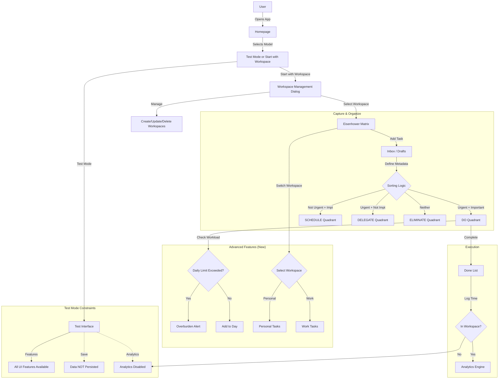

# User Flow: Mental Models App

## Core Logic (Eisenhower Matrix)

## Detailed Flows

### 1. Task Capture

- User enters task in "Inbox".
- System prompts for "Importance" and "Urgency" (or Time Estimate).
- Task is auto-assigned to detailed quadrant.

### 2. Smart Scheduling

- **Due Date Logic**:
  - `Today` or `Tomorrow` -> **DO** or **DELEGATE** (if assigned).
  - `Future Date` -> **SCHEDULE**.
- **Delegation Logic**:
  - Assigned to `Self` -> **DO** or **SCHEDULE**.
  - Assigned to `Others` -> **DELEGATE**.

### 3. Workload Management (New)

- User sets "Max Daily Hours" (e.g., 6 hours).
- System sums `estimatedMinutes` of all active "DO" tasks.
- If Sum > Limit -> Show Warning.
