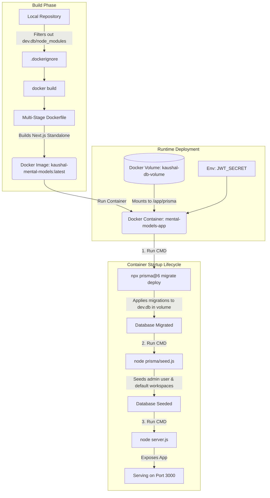

# 🚀 Quick Start & Testing Guide

Follow these steps to launch the Mental Model Repository and verify all systems are functioning correctly in the new **Educative Edition**.

---

## 1. Start the Application

Open your terminal in the project root and run:

📋 **Start command:**

```bash
npm run dev
```

The application will be live at: **[http://localhost:3000](http://localhost:3000)**

---

## 2. Testing Procedure

### Step 1: Professional Portal (Home Page)

- Navigate to the home page.
- You should see the **Mental Models** title with "The Wisdom Lab" header.
- Verify the **Eisenhower Matrix** card has an educational description and a **"Launch App"** button.
- **Theme Test**: Click the **Sun/Moon icon** in the top right. Verify the whole app transitions between light and dark modes instantly.

### Step 2: Integrated Navigation

- Click **"Launch App"**.
- Ensure the **"← Back to Models"** link is present at the top left of the matrix page.
- Click it to verify you can return to the home screen smoothly.

### Step 3: Persistence Check (Onboarding & Redirection Stability)

- Return to the Eisenhower Matrix.
- If it's your first time (or after reset), you should see the **Onboarding Modal**.
- Choose "Start Today" or "Try in Test Mode".
- **URL Parameter Verification**: Confirm that selecting a workspace appends `?workspaceId=<id>` to the URL, and entering Test Mode appends `?testMode=true`.
- **Redirection Stability**: Perform task mutations (e.g., adding, dragging, or deleting tasks) and verify that the page does not get stuck in a redirect loop that re-opens the onboarding modal.

### Step 4: Real-time Categorization (Drag & Drop)

- Create a task in the **Inbox** (left panel).
- Drag it to any quadrant (Do First, Schedule, Delegate, Eliminate).
- Verify the **Assignment Modal** appears for Do, Schedule, and Delegate.
- Complete the specific prompt and verify the task stays in the target quadrant.
- **Verification**: Check that the update is persisted using **Server Actions** (refresh page to confirm).

### Step 5: Advanced Features

- Toggle **"Show Full Matrix"** (should be default view now).
- Test **Reset Mode** using the top header buttons.

### Step 6: Interactive Walkthrough Guides & Sandbox Testing

- **Verify Scroll-Ability**: Run the page tutorial and scroll the page up and down using the mouse wheel or touch gesture. Ensure the highlight overlays and tooltips float correctly in viewport-relative positions and do not stutter or hijack the scroll.
- **Verify "How to Add a Task" Sandbox**:
  - Complete the walkthrough or trigger it from the "Walkthrough Completed" dialog modal.
  - Verify Step 1 highlights the input fields (prefilled with "Sample Task: Learn Eisenhower Matrix" and estimated time "45").
  - Click Add Task. Verify Step 2 highlights the Draft Queue Inbox where the task appears.
  - Advance. Verify Step 3 explains how to drag the task from the Inbox to the appropriate matrix quadrant to finish.
- **Verify "How to Add a Delegate" Sandbox**:
  - Select "How to Add a Delegate" from the completion choices modal.
  - Verify Step 1 highlights the header "Manage Delegates" button.
  - Click Next. Confirm the "Manage Delegates" dialog box automatically opens.
  - Verify Step 2 highlights the teammate name input field inside the open dialog.
  - Verify Step 3 highlights the "Add Team Member" button, asking to type the name and add it.
  - Click Next. Confirm the dialog automatically closes and Step 4 highlights the matrix grid, confirming the delegate is now ready for task assignment.

---

## 🐳 Containerization & Orchestration (4 Deployment Options)

We provide four complete, production-ready methods to deploy the application using the configurations located in the `deployment/` directory.

### 🌟 Interactive Deployment Menu (Recommended)

You can launch our interactive deployment helper script to automatically guide you through building, configuring, and deploying to any of the 4 targets (or starting local dev):

```bash
# Using Make shortcut
make deploy

# Or using npm script
npm run deploy

# Or executing directly
bash scripts/deploy.sh
```

### Option 1: Standalone Docker Container

Build and run the multi-stage, optimized Next.js standalone container. This option mounts a persistent Docker volume to store the SQLite database so that tasks, workspaces, and user accounts are preserved across container updates and restarts.

#### 🏗️ Architecture & Initialization Flow



#### 🚀 Deployment Steps

**Step 1: Create a Persistent Docker Volume**
Create a dedicated named Docker volume to store the SQLite database file:
```bash
docker volume create kaushal-db-volume
```

**Step 2: Build the Docker Image**
Build the optimized production image using the multi-stage Dockerfile:
```bash
docker build -t kaushal-mental-models:latest -f deployment/docker/Dockerfile .
```
> [!NOTE]
> The root-level `.dockerignore` prevents your local database (`prisma/dev.db`) from being copied into the image. This guarantees a clean database initialization inside the container.

**Step 3: Run the Container**
Start the container by mapping the host port `3000` to the container port `3000`, mounting the persistent volume, and setting the required `JWT_SECRET`:
```bash
docker run -d \
  -p 3000:3000 \
  --name mental-models-app \
  -v kaushal-db-volume:/app/prisma \
  -e JWT_SECRET=super-secret-production-key-change-me \
  kaushal-mental-models:latest
```

> [!IMPORTANT]
> * **Persistence**: The volume mounts to `/app/prisma` in the container where `dev.db` is stored. Deleting or recreating the container will **not** lose your database.
> * **Seeding**: On startup, the container automatically runs migrations and seeds the default admin credentials:
>   * **Username:** `admin`
>   * **Password:** `admin`

### Option 2: Docker Compose (Recommended for Single-Host Production)

Deploy the application with automated multi-stage image building, automated database migration, seeding on boot, and automated persistent volume management. 

This option maps the application service to port `3001` on your host and mounts a named volume `kaushal_mental_models_sqlite_data` to ensure data persists across container recreations.

#### 🏗️ Architecture & Orchestration Flow

```mermaid
graph TD
    subgraph Host System
        HostPort[Host Port: 3001] -->|Maps to| ContPort[Container Port: 3000]
        Vol[(Named Volume: kaushal_mental_models_sqlite_data)] -->|Mounts to| ContDbPath[/app/prisma]
    end

    subgraph Docker Compose Service: web
        Image[Builds deployment/docker/Dockerfile] --> Cont(Container: kaushal-mental-models-app)
        ContDbPath --- Cont
        ContPort --- Cont
        Env[Env: JWT_SECRET / PORT / DATABASE_URL] --> Cont
    end

    subgraph Startup lifecycle
        Cont -->|1. Applies migrations| Mig[npx prisma@6 migrate deploy]
        Mig -->|2. Seeds admin credentials| Seed[node prisma/seed.js]
        Seed -->|3. Starts server| Run[node server.js]
    end
```

#### 🚀 Deployment Steps

**Step 2: Package, Tag, and Push the Docker Image**
Build the Next.js standalone image, tag it with `latest` and `v1.2` labels, and push both tags to your Docker Hub repository:
```bash
# 1. Build the standalone image
docker build -t kaushal95300/kaushal-mental-models:latest -f deployment/docker/Dockerfile .

# 2. Add the version tag
docker tag kaushal95300/kaushal-mental-models:latest kaushal95300/kaushal-mental-models:v1.2

# 3. Push to Docker Hub (ensure you ran 'docker login -u kaushal95300' first)
docker push kaushal95300/kaushal-mental-models:latest
docker push kaushal95300/kaushal-mental-models:v1.2
```

**Step 3: Pull & Start the Application**
Pull the registry image and launch the container in detached mode:
```bash
make compose
# or
docker compose -f deployment/docker-compose/docker-compose.yml pull
docker compose -f deployment/docker-compose/docker-compose.yml up -d
```

**Step 4: Update the App & Hot-Reload with Database Backups**
Whenever a new update is pushed to Docker Hub, pull the fresh image layers and hot-recreate the container without losing data. This command also creates a database copy on the host:
```bash
make app-update
```
> [!NOTE]
> `make app-update` executes `docker cp kaushal-mental-models-app:/app/prisma/dev.db ./dev_db_backup_before_update.db` to back up your database to the host directory before pulling the registry updates and starting the new container.

**Step 5: Monitor Logs & Container Status**
Check if the service started correctly, ran migrations, seeded the database, and is listening:
```bash
# View container status
docker compose -f deployment/docker-compose/docker-compose.yml ps

# View live container startup logs
docker compose -f deployment/docker-compose/docker-compose.yml logs -f
```

**Step 6: Stop / Tear Down the Service**
To stop the application, remove the container, and clean up the internal networks (while keeping your database volume intact):
```bash
docker compose -f deployment/docker-compose/docker-compose.yml down
```

> [!IMPORTANT]
> * **Host Access URL**: The application is exposed on host port `3001`: **[http://localhost:3001](http://localhost:3001)**
> * **Database Persistence**: The SQLite data is stored securely in the named volume `kaushal_mental_models_sqlite_data`. Recreating the container will **not** delete your data. To clean up the database completely, append the `-v` flag: `docker compose down -v`.

### Option 3: Vanilla Kubernetes (K8s) Manifests

Deploy to any standard Kubernetes cluster using native declarative manifests:

```bash
# Apply ConfigMap, PVC, Deployment, Service, and Ingress
kubectl apply -f deployment/k8s/configmap.yaml
kubectl apply -f deployment/k8s/deployment.yaml
kubectl apply -f deployment/k8s/service.yaml
kubectl apply -f deployment/k8s/ingress.yaml

# Verify pod status
kubectl get pods -l app=kaushal-mental-models
```

### Option 4: Helm Chart (Recommended for Enterprise K8s)

Deploy using our fully templated, dynamic Helm package manager:

```bash
# Install or upgrade the Helm chart
helm upgrade --install mental-models-app ./deployment/helm/kaushal-mental-models --namespace production --create-namespace

# Check Helm release status
helm status mental-models-app -n production
```

---

## 🐳 Containerization & Orchestration (4 Deployment Options)

We provide four complete, production-ready methods to deploy the application using the configurations located in the `deployment/` directory.

### 🌟 Interactive Deployment Menu (Recommended)

You can launch our interactive deployment helper script to automatically guide you through building, configuring, and deploying to any of the 4 targets (or starting local dev):

```bash
# Using Make shortcut
make deploy

# Or using npm script
npm run deploy

# Or executing directly
bash scripts/deploy.sh
```

### Option 1: Standalone Docker Container

Build and run the multi-stage, optimized Next.js standalone container. This option mounts a persistent Docker volume to store the SQLite database so that tasks, workspaces, and user accounts are preserved across container updates and restarts.

#### 🏗️ Architecture & Initialization Flow


#### 🚀 Deployment Steps

**Step 1: Create a Persistent Docker Volume**
Create a dedicated named Docker volume to store the SQLite database file:
```bash
docker volume create kaushal-db-volume
```

**Step 2: Build the Docker Image**
Build the optimized production image using the multi-stage Dockerfile:
```bash
docker build -t kaushal-mental-models:latest -f deployment/docker/Dockerfile .
```
> [!NOTE]
> The root-level `.dockerignore` prevents your local database (`prisma/dev.db`) from being copied into the image. This guarantees a clean database initialization inside the container.

**Step 3: Run the Container**
Start the container by mapping the host port `3000` to the container port `3000`, mounting the persistent volume, and setting the required `JWT_SECRET`:
```bash
docker run -d \
  -p 3000:3000 \
  --name mental-models-app \
  -v kaushal-db-volume:/app/prisma \
  -e JWT_SECRET=super-secret-production-key-change-me \
  kaushal-mental-models:latest
```

> [!IMPORTANT]
> * **Persistence**: The volume mounts to `/app/prisma` in the container where `dev.db` is stored. Deleting or recreating the container will **not** lose your database.
> * **Seeding**: On startup, the container automatically runs migrations and seeds the default admin credentials:
>   * **Username:** `admin`
>   * **Password:** `admin`

### Option 2: Docker Compose (Recommended for Single-Host Production)

Deploy the application with automated multi-stage image building, automated database migration, seeding on boot, and automated persistent volume management. 

This option maps the application service to port `3001` on your host and mounts a named volume `kaushal_mental_models_sqlite_data` to ensure data persists across container recreations.

#### 🏗️ Architecture & Orchestration Flow

```mermaid
graph TD
    subgraph Host System
        HostPort[Host Port: 3001] -->|Maps to| ContPort[Container Port: 3000]
        Vol[(Named Volume: kaushal_mental_models_sqlite_data)] -->|Mounts to| ContDbPath[/app/prisma]
    end

    subgraph Docker Compose Service: web
        Image[Builds deployment/docker/Dockerfile] --> Cont(Container: kaushal-mental-models-app)
        ContDbPath --- Cont
        ContPort --- Cont
        Env[Env: JWT_SECRET / PORT / DATABASE_URL] --> Cont
    end

    subgraph Startup lifecycle
        Cont -->|1. Applies migrations| Mig[npx prisma@6 migrate deploy]
        Mig -->|2. Seeds admin credentials| Seed[node prisma/seed.js]
        Seed -->|3. Starts server| Run[node server.js]
    end
```

#### 🚀 Deployment Steps

**Step 1: Verify the Configuration**
Review the configuration file at [deployment/docker-compose/docker-compose.yml](file:///Users/kaushalsoni/Desktop/WS/kaushal-mental-models/deployment/docker-compose/docker-compose.yml). Ensure the `JWT_SECRET` environment variable is configured:
```yaml
environment:
  - NODE_ENV=production
  - PORT=3000
  - DATABASE_URL=file:/app/prisma/dev.db
  - JWT_SECRET=super-secret-production-key-change-me
```

**Step 2: Build & Start the Application**
Launch the multi-container environment in detached mode:
```bash
docker compose -f deployment/docker-compose/docker-compose.yml up -d --build
```
> [!NOTE]
> Docker Compose will automatically build the production Next.js image using the root context and compile the standalone server.

**Step 3: Monitor Logs & Container Status**
Check if the service started correctly, ran migrations, seeded the database, and is listening:
```bash
# View container status
docker compose -f deployment/docker-compose/docker-compose.yml ps

# View live container startup logs
docker compose -f deployment/docker-compose/docker-compose.yml logs -f
```

**Step 4: Stop / Tear Down the Service**
To stop the application, remove the container, and clean up the internal networks (while keeping your database volume intact):
```bash
docker compose -f deployment/docker-compose/docker-compose.yml down
```

> [!IMPORTANT]
> * **Host Access URL**: The application is exposed on host port `3001`: **[http://localhost:3001](http://localhost:3001)**
> * **Database Persistence**: The SQLite data is stored securely in the named volume `kaushal_mental_models_sqlite_data`. Running `docker compose down` will **not** delete your data. To clean up the database completely, append the `-v` flag: `docker compose down -v`.

### Option 3: Vanilla Kubernetes (K8s) Manifests

Deploy to any standard Kubernetes cluster using native declarative manifests:

```bash
# Apply ConfigMap, PVC, Deployment, Service, and Ingress
kubectl apply -f deployment/k8s/configmap.yaml
kubectl apply -f deployment/k8s/deployment.yaml
kubectl apply -f deployment/k8s/service.yaml
kubectl apply -f deployment/k8s/ingress.yaml

# Verify pod status
kubectl get pods -l app=kaushal-mental-models
```

### Option 4: Helm Chart (Recommended for Enterprise K8s)

Deploy using our fully templated, dynamic Helm package manager:

```bash
# Install or upgrade the Helm chart
helm upgrade --install mental-models-app ./deployment/helm/kaushal-mental-models --namespace production --create-namespace

# Check Helm release status
helm status mental-models-app -n production
```

---

## 🐳 Containerization & Orchestration (4 Deployment Options)

We provide four complete, production-ready methods to deploy the application using the configurations located in the `deployment/` directory.

### 🌟 Interactive Deployment Menu (Recommended)

You can launch our interactive deployment helper script to automatically guide you through building, configuring, and deploying to any of the 4 targets (or starting local dev):

```bash
# Using Make shortcut
make deploy

# Or using npm script
npm run deploy

# Or executing directly
bash scripts/deploy.sh
```

### Option 1: Standalone Docker Container

Build and run the multi-stage, optimized Next.js standalone container. Database migrations are applied automatically at container startup.

```bash
# Build the Docker image
docker build -t kaushal-mental-models:latest -f deployment/docker/Dockerfile .

# Run the container on port 3000 (Note: JWT_SECRET is required in production)
docker run -d -p 3000:3000 -e JWT_SECRET=your-strong-production-key-here --name mental-models-app kaushal-mental-models:latest
```

### Option 2: Docker Compose (Recommended for Single-Host Production)

Deploy the application with automated persistent SQLite volume management and schema updates.

```bash
# Start the multi-container environment
# Be sure to customize JWT_SECRET in deployment/docker-compose/docker-compose.yml
docker compose -f deployment/docker-compose/docker-compose.yml up -d --build

# View real-time logs
# docker compose -f deployment/docker-compose/docker-compose.yml logs -f
```

### Option 3: Vanilla Kubernetes (K8s) Manifests

Deploy to any standard Kubernetes cluster using native declarative manifests:

```bash
# Apply ConfigMap, PVC, Deployment, Service, and Ingress
kubectl apply -f deployment/k8s/configmap.yaml
kubectl apply -f deployment/k8s/deployment.yaml
kubectl apply -f deployment/k8s/service.yaml
kubectl apply -f deployment/k8s/ingress.yaml

# Verify pod status
kubectl get pods -l app=kaushal-mental-models
```

### Option 4: Helm Chart (Recommended for Enterprise K8s)

Deploy using our fully templated, dynamic Helm package manager:

```bash
# Install or upgrade the Helm chart
helm upgrade --install mental-models-app ./deployment/helm/kaushal-mental-models --namespace production --create-namespace

# Check Helm release status
helm status mental-models-app -n production
```

---

## 🛠 Maintenance Commands

📋 **Sync database schema if errors occur:**

```bash
npx prisma db push
```

📋 **Code Linting:**

```bash
npm run lint
```

📋 **Code Formatting:**

```bash
npx prettier --write "src/**/*.{ts,tsx,css}"
```

📋 **Generate production build:**

```bash
npm run build
```

```bash
npm start
```

---

## ✅ Final Checklist

- [ ] No database "Table not found" errors
- [ ] Premium Dark/Light mode functional on all pages
- [ ] Home button navigation functional
- [ ] Real-time category updates working
- [ ] Cross-page theme synchronization (Home-Matrix-Analytics)
- [ ] URL parameters (`workspaceId` and `testMode`) are updated correctly and do not cause redirection loops during task operations
- [ ] Interactive 4-Track Video Tour with text-to-speech audio launches automatically on first-time login and manual "Watch Tour" click
- [ ] Contextual step-by-step PageTutorials run successfully on Focus Matrix and Analytics Dashboard
- [ ] Persistent "Don't show again" preference is respected and stored in local storage
- [ ] Audio synthesis for ticks, swooshes, and chimes plays successfully via Web Audio API context
